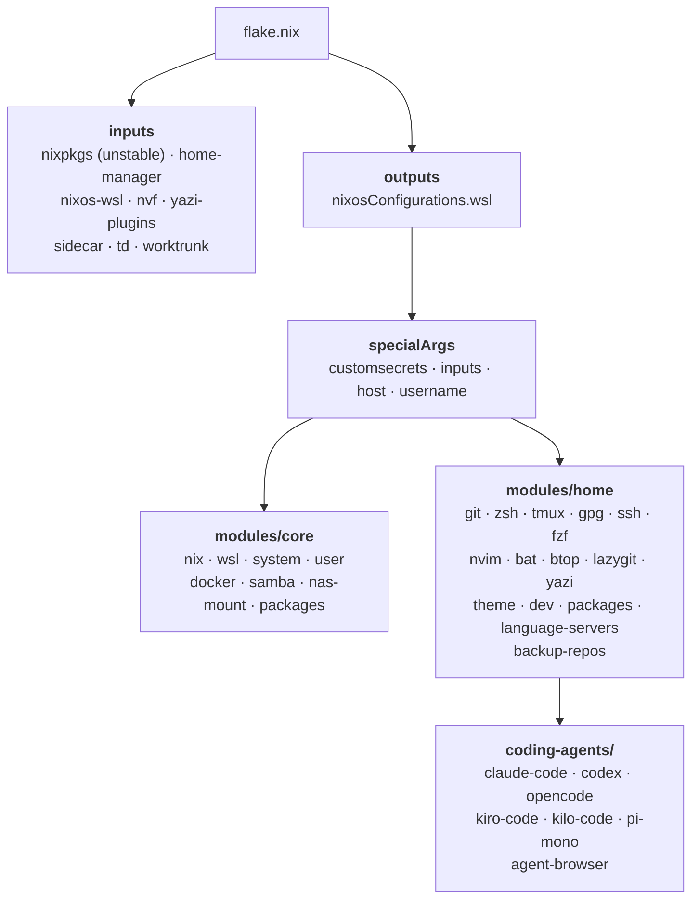
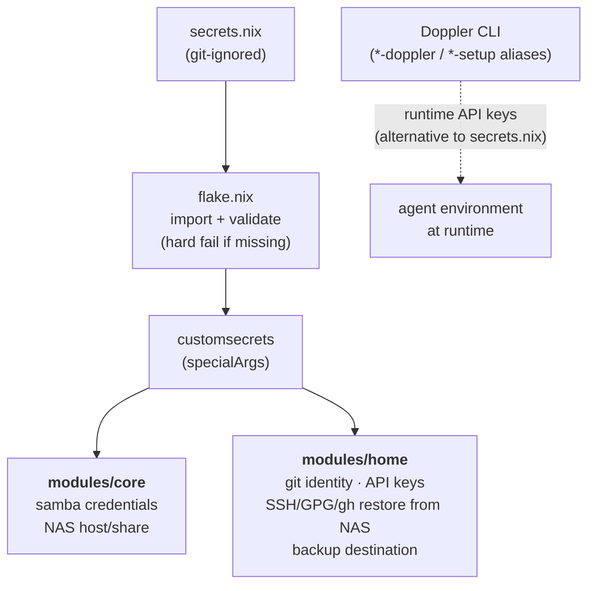

<!-- DO NOT TOUCH THIS SECTION#1: START -->
<h1 align="center">
   
   <br>
      moshpitcodes.wsl.nix | NixOS Configuration for WSL2
   <br>
       <br>

   <div align="center">
      <p></p>
      <div align="center">
         <a href="https://github.com/MoshPitCodes/moshpitcodes.wsl.nix/stargazers">
            
         </a>
         <a href="https://github.com/MoshPitCodes/moshpitcodes.wsl.nix/">
            
         </a>
         <a href="https://nixos.org">
            
         </a>
      </div>
      <br>
   </div>
   <div>
      <a href="https://github.com/MoshPitCodes/moshpitcodes.wsl.nix/actions/workflows/test-flake.yml">
         
      </a>
      <a href="https://github.com/MoshPitCodes/moshpitcodes.wsl.nix/actions/workflows/build-configurations.yml">
         
      </a>
   </div>
</h1>

<br/>
<!-- DO NOT TOUCH THIS SECTION#1: END -->

# Overview

NixOS configuration for WSL2 on Windows 11. This follows the same broad shape as [moshpitcodes.nix](https://github.com/MoshPitCodes/moshpitcodes.nix), but keeps the system side focused on WSL instead of desktop hardware, Wayland, GPU, audio, bootloader, or laptop-specific services.

> [!WARNING]
> This is a heavily opinionated configuration that is likely not a great repository if you're just starting out with Linux, NixOS, or WSL. The setup is tailored to my specific needs and will likely not provide a great baseline for you to build off of.

<br/>

## Documentation

| Document | Description |
|----------|-------------|
| [Installation](docs/installation.md) | NixOS-WSL import / first boot |
| [Configuration](docs/configuration.md) | WSL specifics: mounts, interop, systemd, secrets, agents |
| [Development Shells](docs/development-shells.md) | `nix develop`, formatter, nvf editor |
| [Secrets](SECRETS.md) | Secret management guide |

<br/>

## Project Structure

- [./flake.nix](flake.nix) Flake entrypoint with the `wsl` NixOS configuration
- [./hosts/wsl/](hosts/wsl) WSL host settings
- [./modules/](modules) Modularized NixOS configurations
  - [../core/](modules/core) System level: Nix settings, WSL integration, user, Docker, NAS/Samba, and a minimal root bootstrap package set
  - [../home/](modules/home) [Home Manager](https://github.com/nix-community/home-manager): shell, Git, SSH, tmux, editor, coding agents, and all user-facing packages (single source of truth — nothing is duplicated at the system level)
- [./overlays/](overlays) Nixpkgs overlays (`sidecar`, `td`, `terraform`, `worktrunk`, `cpplint`, `switch-to-configuration`)
- [./docs/](docs) Project documentation
- [./justfile](justfile) Repo tasks (`just rebuild` / `test` / `build` / `update` / `fmt` / `lint` / `check`)
- [./secrets.nix.example](secrets.nix.example) Local secrets template

> [!TIP]
> If you open this `README.md` file in [VSCode][VSCode] or [VSCodium][VSCodium], you can `Ctrl + LMB` the links above.

<br/>

## Project Components

| Use Case                    | Software                                                                            |
| --------------------------- | :---------------------------------------------------------------------------------- |
| **Shell**                   | [zsh][zsh] + [Starship][Starship]                                                   |
| **Terminal Multiplexer**    | [tmux][tmux]                                                                        |
| **Fuzzy Finder**             | [fzf][fzf] + [fzf-tab][fzf-tab]                                                     |
| **Text Editor**             | [Neovim][Neovim] via [nvf][nvf]                                                     |
| **AI Development**          | [Claude Code][Claude Code], [Codex][Codex], [OpenCode][OpenCode], [Kiro][Kiro], [Kilo Code][Kilo Code], [Pi][Pi] |
| **Git UI**                  | [lazygit][lazygit]                                                                  |
| **File Manager**            | [yazi][yazi]                                                                        |
| **System Resource Monitor** | [btop][btop]                                                                        |
| **Secrets**                 | Local `secrets.nix` + [Doppler][Doppler]                                            |
| **Password Manager**        | [1Password CLI][1Password]                                                          |
| **Network Storage**         | Samba/CIFS mount to a NAS (lazy automount)                                          |
| **DevOps Tools**            | kubectl, terraform, ansible, helm, k9s, Docker Compose                              |

<br/>

# Architecture



Cross-cutting module args (set once, consumed everywhere):

- `palette` (`modules/home/theme.nix`) — the Everforest color palette shared by
  btop, fzf, lazygit, and nvim; swapping the theme is a one-file change.
- `lspLanguages` (`modules/home/language-servers.nix`) — language enablement
  flags shared between the LSP tool packages and the nvf editor modules.
- API keys are injected once in `modules/home/coding-agents/default.nix`, not
  per agent.



<br/>

# Getting Started

> [!CAUTION]
> Customizing system configurations, particularly those affecting operating systems, may lead to unforeseen effects and potentially disrupt your system's standard operations. Although I've personally tested these settings on my own hardware, they might not perform identically on your specific setup.
> **I cannot assume responsibility for any problems that might result from implementing this configuration.**

> [!WARNING]
> You **must** examine the configuration details and adjust them according to your specific requirements before proceeding.

<br/>

## 1. Install NixOS-WSL

From Windows PowerShell:

```powershell
wsl --install --no-distribution
```

Download the latest `nixos.wsl` release from [NixOS-WSL](https://github.com/nix-community/NixOS-WSL), then import or open it according to the upstream instructions, and start it with:

```powershell
wsl -d NixOS
```

See the [Installation Guide](docs/installation.md) for detailed instructions.

<br/>

## 2. Clone the Repository

```bash
nix-shell -p git
git clone https://github.com/MoshPitCodes/moshpitcodes.wsl.nix
cd moshpitcodes.wsl.nix
```

<br/>

## 3. Configure Secrets

> [!TIP]
> To ensure you understand what you're executing, it's advisable to review the code base or at minimum consult the documentation thoroughly before applying the configuration.

### Create Your Secrets File

```bash
cp secrets.nix.example secrets.nix
$EDITOR secrets.nix
```

See the [Secrets Guide](SECRETS.md) for detailed instructions on configuring credentials and API keys.

### Apply Configuration

```bash
sudo nixos-rebuild switch --flake .#wsl --impure
# or, with the bundled justfile:
just rebuild
```

`--impure` is required because `secrets.nix` is loaded through an impure path and is intentionally git-ignored. Run from the repo root — a missing `secrets.nix` fails evaluation with instructions rather than building a fallback system.

<br/>

# Key Features

<details>
<summary>
WSL Integration
</summary>

- **Windows Interop**: Windows PATH appended, drives mounted under `/mnt`
- **Systemd**: enabled through `/etc/wsl.conf`
- **GPU/CUDA Passthrough**: OpenGL/CUDA libraries from the Windows host exposed via `wsl.useWindowsDriver`

</details>

<details>
<summary>
Development Tools
</summary>

- **Nix Dev Environment**: Reproducible shell via `nix develop`
- **AI Coding Agents**: Claude Code, Codex, OpenCode, Kiro, Kilo Code, and Pi, each wired to `customsecrets.apiKeys`
- **Full DevOps Stack**: kubectl, terraform, ansible, Docker Compose, and more

</details>

<details>
<summary>
Secrets &amp; Backups
</summary>

- **File-Based Secrets**: `secrets.nix` (git-ignored) validated and threaded through `specialArgs` as `customsecrets`
- **NAS-Backed Restore**: SSH and GPG keys, and `gh` config, restored from a NAS backup on first activation
- **Automated Backups**: daily `backup-repos` user service rsyncs `~/Code` to a NAS, gated by a safety marker file

</details>

<details>
<summary>
System Management
</summary>

- **Declarative Rebuilds**: standard NixOS rebuild workflow (`just rebuild`) with optional Doppler integration
- **Lazy NAS Mount**: Samba/CIFS share mounted on-demand via `noauto` + `x-systemd.automount`, so it never blocks WSL boot; fully inert without a `nas` secrets block
- **Modular Operations**: host-specific and shared behavior split across reusable `modules/core` (minimal system layer) and `modules/home` (all user tooling)
- **Shared Theme Palette**: one Everforest palette (`modules/home/theme.nix`) drives btop, fzf, lazygit, and nvim
- **CI + Automation**: PRs run flake checks, statix/deadnix lints, and format checks; `flake.lock` is bumped weekly by a scheduled workflow

</details>

<br/>

# Credits

Other resources and links:

- [moshpitcodes.nix](https://github.com/MoshPitCodes/moshpitcodes.nix): the desktop/laptop counterpart to this configuration
- [NixOS-WSL](https://github.com/nix-community/NixOS-WSL): the NixOS-on-WSL2 project this configuration builds on

- Official Resources
  - [NixOS Homepage](https://nixos.org/)
  - [NixOS Manual](https://nixos.org/manual/nixos/stable/)
  - [NixOS Flakes](https://wiki.nixos.org/wiki/Flakes)
  - [nixpkgs](https://github.com/NixOS/nixpkgs)
  - [Home Manager Manual](https://nix-community.github.io/home-manager/)

<br/>

<!-- DO NOT TOUCH THIS SECTION#2: START -->

<p align="center"></p>

<br/>

<p align="center"></p>

<div align="right">
  <a href="#readme">Back to the Top</a>
</div>
<!-- DO NOT TOUCH THIS SECTION#2: END -->

<!-- Links -->
[zsh]: https://ohmyz.sh/
[Starship]: https://starship.rs/
[tmux]: https://github.com/tmux/tmux
[fzf]: https://github.com/junegunn/fzf
[fzf-tab]: https://github.com/Aloxaf/fzf-tab
[Neovim]: https://github.com/neovim/neovim
[nvf]: https://github.com/notashelf/nvf
[Claude Code]: https://github.com/anthropics/claude-code
[Codex]: https://github.com/openai/codex
[OpenCode]: https://opencode.ai/
[Kiro]: https://kiro.dev/
[Kilo Code]: https://kilocode.ai/
[Pi]: https://github.com/badlogic/pi-mono
[lazygit]: https://github.com/jesseduffield/lazygit
[yazi]: https://github.com/sxyazi/yazi
[btop]: https://github.com/aristocratos/btop
[Doppler]: https://www.doppler.com/
[1Password]: https://1password.com/
[VSCodium]: https://vscodium.com/
[VSCode]: https://code.visualstudio.com/
